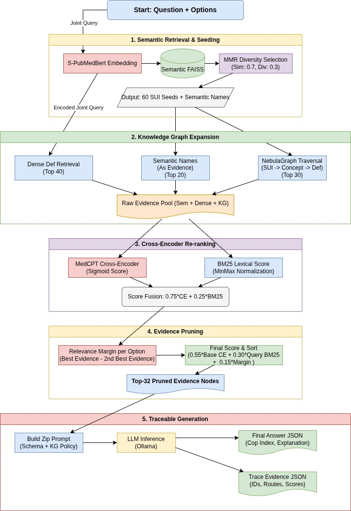

# 🧬 Medical KG-RAG Evidence Pipeline

**Python • FAISS • NebulaGraph • Streamlit • LLM**

A highly traceable, asynchronous Retrieval-Augmented Generation (RAG) pipeline designed for complex medical reasoning. This framework utilizes a hybrid retrieval approach—combining dense vector search, lexical BM25, and Knowledge Graph (KG) traversal—to anchor Large Language Model (LLM) reasoning strictly to factual evidence.

It is specifically designed to handle challenging medical Multiple Choice Questions (MCQs), including standard fact retrieval, "None of the above" exclusions, and adversarial/fake medical premises.

---

# 🏗️ Architecture


<p align="center">
  
</p>

The pipeline follows a five-step process:

### 1. Semantic Retrieval & Seeding
- Encodes the joint query (**Question + Options**) using **S-PubMedBert**
- Searches a Semantic FAISS index
- Applies **MMR (Maximal Marginal Relevance)** to ensure diversity
- Produces the **Top 60 SUI Seeds**

### 2. Knowledge Graph Expansion
- Traverses NebulaGraph:

```
SUI → Concept → Definition
```

- Retrieves structured definitions from the knowledge graph
- Simultaneously retrieves raw dense definitions from a secondary FAISS index
- Pools Semantic, Dense, and KG evidence into a unified evidence set

### 3. Cross-Encoder Re-ranking
Re-scores the raw evidence pool using a fusion strategy:

```text
Final Score =
0.75 × MedCPT Cross-Encoder (Sigmoid)
+
0.25 × BM25 Lexical Score
```

### 4. Evidence Pruning
Computes a discriminative margin for each answer option:

```text
Margin =
Best Evidence Score − Second Best Evidence Score
```

Uses the margin to remove redundant information and outputs the **Top 32 most critical evidence nodes**.

### 5. Traceable Generation
Packages the selected evidence into a strict JSON-schema prompt. The LLM (via Ollama/OpenAI API) is forced to:

- Generate structured reasoning
- Explicitly cite evidence identifiers
- Ground every claim in retrieved evidence

Example:

```text
[E1], [E5], [E12]
```

---

# ✨ Key Features

### 🔒 Strict Evidence Grounding
LLMs are explicitly prompted to rely only on retrieved evidence and are forced to cite exact evidence identifiers (`[E#]`).

### 🚫 Adversarial / Fake Concept Handling
Built-in logic forces models to abstain (`-1`) when questions contain fabricated medical concepts or unsupported premises.

### 🔍 Explainability & Diagnostics
Includes advanced evaluation scripts for:

- Shapley Value estimation
- Necessity testing
- Sufficiency testing
- Redundancy testing
- Evidence contribution analysis

### ⚡ Asynchronous & High-Throughput
Built using:

- `asyncio`
- `httpx`
- Automated retry logic
- Exponential backoff

for concurrent batch processing.

### 📊 Deep Analytics Dashboard
Interactive Streamlit dashboard for:

- Evidence Rank Distributions
- KG Advantage
- Confidence Calibration
- Reasoning Complexity Analysis

---

# 📂 Repository Structure

| File | Description |
|------|-------------|
| `main.py` | Entry point for batch-processing CSV datasets asynchronously |
| `pipeline.py` | Core RAG logic (`AsyncKGMCQPipeline`) handling retrieval, fusion, pruning, and generation |
| `dashboard.py` | Streamlit dashboard for visualizing results, accuracy, and retrieval decay |
| `explainability.py` | Runs Necessity, Sufficiency, and Redundancy tests on model answers |
| `shapley_eval.py` | Computes Shapley values for evidence and tests for "Lost in the Middle" bias |
| `evaluation/evaluator.py` | Computes subset variance, accuracies, and penalty scoring |
| `analyze_results.py` | CLI tool to analyze evidence route usage and complexity |
| `run_experiments.py` | Orchestrator to run pipelines iteratively across multiple LLMs |
| `clients.py` | Thread-safe DB client (NebulaGraph) and async LLM client (Ollama/OpenAI format) |
| `utils.py` | Core mathematical operations (BM25, MMR, Sigmoid) and JSON repair/sanitization |
| `config.py` | System configurations, DB credentials, and file paths |

---

# 🚀 Getting Started

## 1. Prerequisites

- Python 3.9+
- NebulaGraph instance running with the appropriate space (`petagraph`)
- FAISS indices pre-built and paths mapped in `config.py`
- GPU access for SentenceTransformer and CrossEncoder inference
- Ollama or an OpenAI-compatible LLM endpoint

---

## 2. Installation

Clone the repository:

```bash
git clone https://github.com/yourusername/evidence_pipeline.git
cd evidence_pipeline
```

Install dependencies:

```bash
pip install -r requirements.txt
```

---

## 3. Configuration

Update `config.py`:

```python
NEBULA_HOST = "127.0.0.1"
NEBULA_SPACE = "petagraph"
OPENAI_BASE_URL = "https://ollama.zib.de/api"
```

Set your API key:

### Linux / macOS

```bash
export API_KEY="your-api-key-here"
```

### Windows (PowerShell)

```powershell
$env:API_KEY="your-api-key-here"
```

---

# 💻 Usage

## 1. Run the Core Pipeline

Process a CSV of multiple-choice questions:

```bash
python main.py \
  --csv data/reasoning_fake.csv \
  --task reasoning_fake \
  --model gemma2:27b \
  --workers 5 \
  --subset_size 100
```

Outputs are saved in the `outputs/` directory:

- JSON cache
- Model generations
- Compiled CSV reports

---

## 2. Run Automated Experiments

Configure `MODELS_TO_RUN` in `run_experiments.py`, then execute:

```bash
python run_experiments.py
```

---

## 3. Launch the Streamlit Dashboard

```bash
streamlit run dashboard.py
```

Visualize:

- Pipeline performance
- Calibration curves
- Retrieval distributions
- Evidence usage patterns

---

# 🔬 Advanced Diagnostics

The repository includes tools to investigate why the LLM made its decisions.

## Explainability Interventions (Counterfactuals)

Tests whether the model truly needed the evidence it cited.

### Necessity
Re-runs the query after removing the cited evidence.

### Sufficiency
Re-runs the query using only the cited evidence.

### Redundancy
Re-runs the query after removing duplicated information.

Example:

```bash
python explainability.py \
  --csv data.csv \
  --task reasoning_nota \
  --model phi4:14b
```

---

## Shapley Value & Positional Bias Testing

Calculates the contribution of each cited evidence block and evaluates whether the model suffers from **Lost in the Middle** bias.

Example:

```bash
python shapley_eval.py \
  --csv data.csv \
  --task reasoning_fct \
  --model deepseek-r1:14b
```

---

# 📊 Evaluation Metrics Tracked

## KG Advantage
Measures the accuracy difference when the pipeline successfully utilizes knowledge graph traversals versus falling back to dense vector search.

```text
KG Advantage =
Accuracy(KG Retrieval)
−
Accuracy(Dense Retrieval)
```

---

## Confidence Calibration
Evaluates whether higher retriever scores correlate with higher LLM accuracy.

---

## Reasoning Complexity

Questions are categorized as:

- **Simple:** 1 evidence node used
- **Complex:** More than 1 evidence node used
- **Abstentions:** Model safely rejected a fake premise

---


## Citation

If you use this repository in your research, please cite:

```bibtex
@software{medical_kgrag_evidence_pipeline,
  title  = {Medical KG-RAG Evidence Pipeline},
  author = {Manasi Acharya},
  year   = {2026},
  url    = {https://github.com/acharya221b/evidence_pipeline}
}
```

